## Подход к решению

Я решил не использовать кодогенерацию с помощью условного oapi-codegen, так как хотел полный контроль над разработкой всех частей сервиса.

Решил не использовать сторонние библиотеки для роутинга `(echo/chi/gorilla/gin etc)`, а использовать только `net/http`.


## Архитектура 

Было принято решение придерживаться `DDD` подхода.
Взаимодейстиве между слоями основа на интерфейсах, что позволит легче изменять решение или масштабироваться.

Каждая фича выделена в отдельную директорий, внутри которой есть свои `application`, `domain`, `infra`, `delivery`.

```
/internal/team
/internal/pullrequest
/internal/users
```

Дополнительно была сделана ручка для сборки статистики.
```
/internal/stats
```

## Обработка ошибок

Я определил ошибки на уровне домена, потому что это является бизнес правилами.  
Handler'ы проверяют ошибки через switch case и возвращают ответ при помощи `/pkg/httpcommon`.


## Архитектура базы данных

Есть 3 основные таблицы:
1. Teams
2. Users
3. Pull Request

Так же была сделана таблица для соединения `users` и `pull_requests`, потому что тут мы имеем отношений `M x M`.

Учитывая запросы были добавлены индексы для ускорения. 

Миграции можно увидеть в `./migrations`, для "накатывания" используется библиотека goose


## Логирование 

Для логирования был использован `uber-go/zap`


## Установка и запуск

Есть два варианта:

1. `go run` ли через `make`
2. `docker`

### Первый вариант

1. Склонировать репозиторий

```sh
https://github.com/dunooo0ooo/avito-test-task
```
2. Перейти в корень репозитория.
3. Создать `.env`, скопировав в него содержимое из `.env.example`.
4. Выполнить `make run` или `go run cmd/main.go`.

### Второй вариант

Первые 3 шага аналогичны предыдущему способу.

Далее:

1. Отредактировать `Dockerfile` и `docker-compose.yaml`, если требуется.
2. Запуск через `docker compose up --build`, если нужны логи или `docker docker compose up -d`, чтобы запустить демона.

```sh
docker compose up --build
```
```sh
docker compose up -d
```

После запуска сервер будет доступен по адресу `http://localhost:8080`.


## Тестирование

Юнит-тесты были написаны для самых основных частей программы

Запустить можно при помощи `make test`

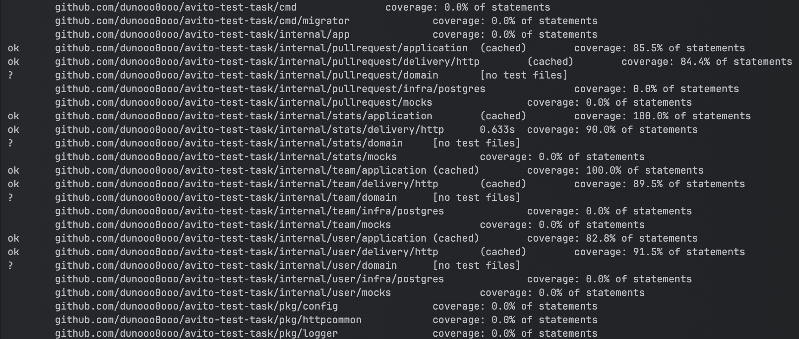

Запустить можно при помощи `make test-integration`

Добавлен интеграционный тест `/tests/intregration`

### Ручное тестирование

`/team/add`

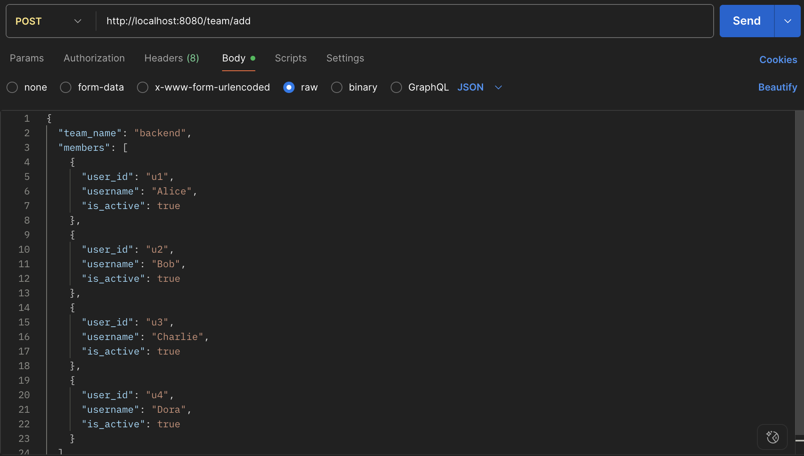
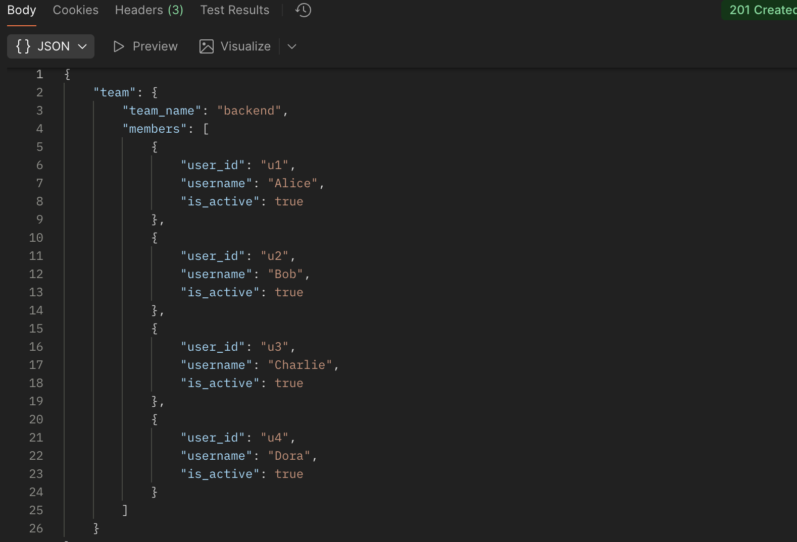
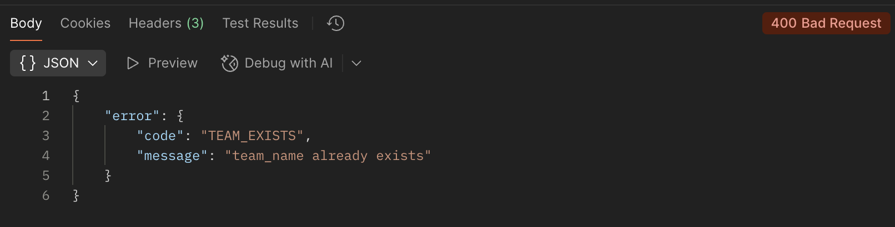

`/team/get`

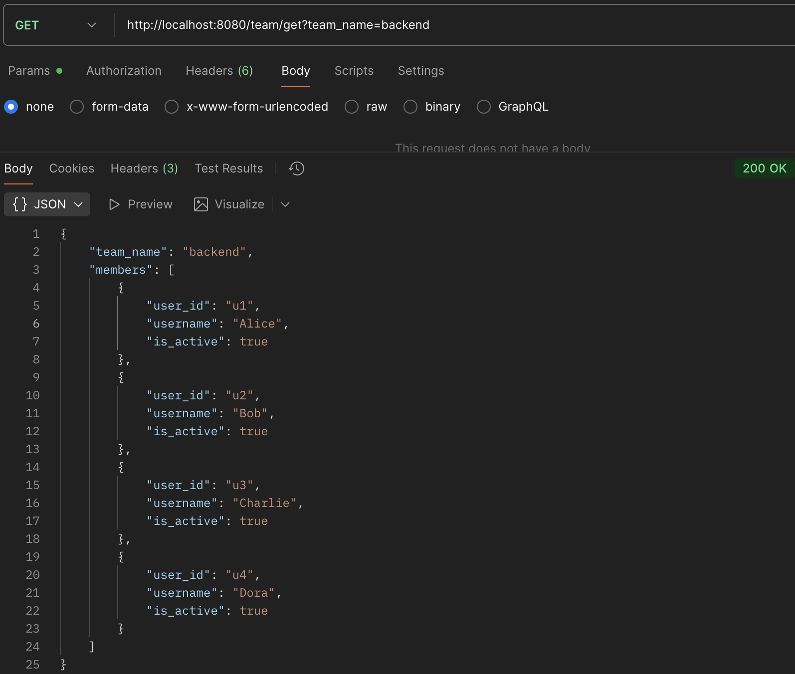
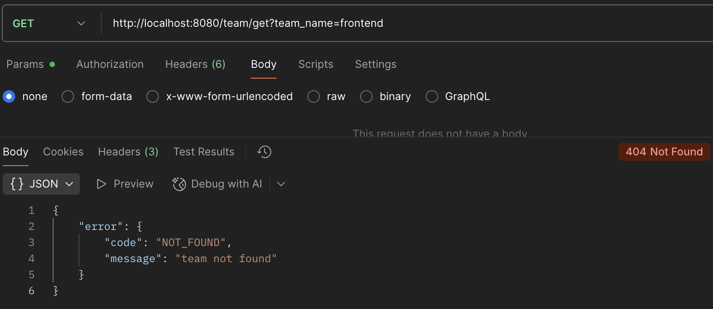

`/users/setIsActive`


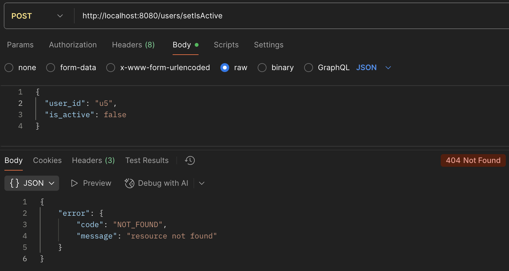

`/pullrequest/create`

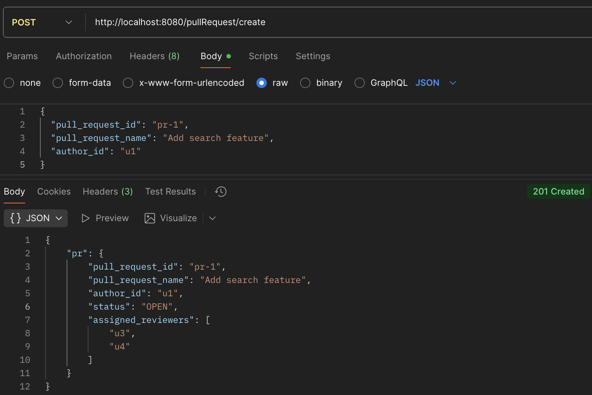
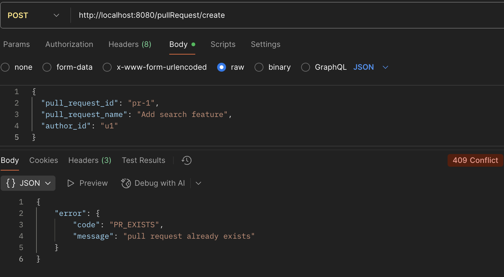

`/pullrequest/merge`


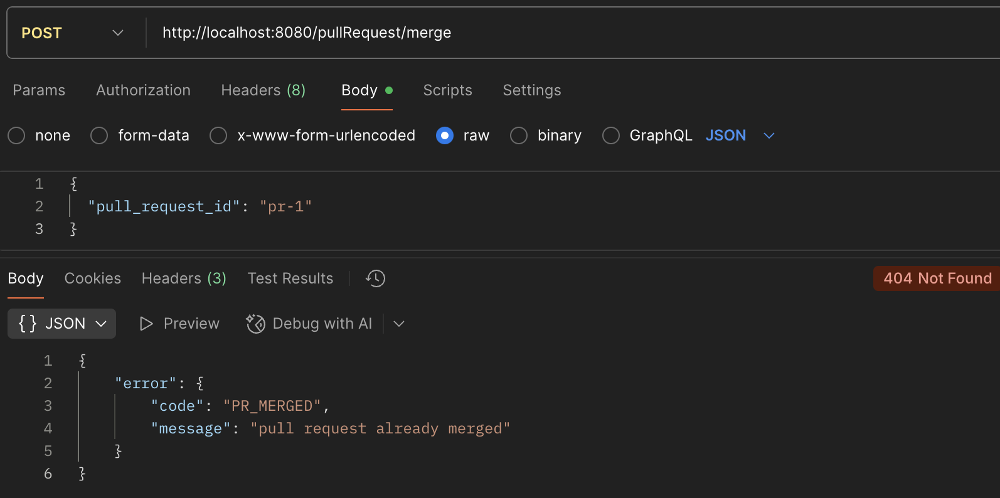

`/pullRequest/reassign`

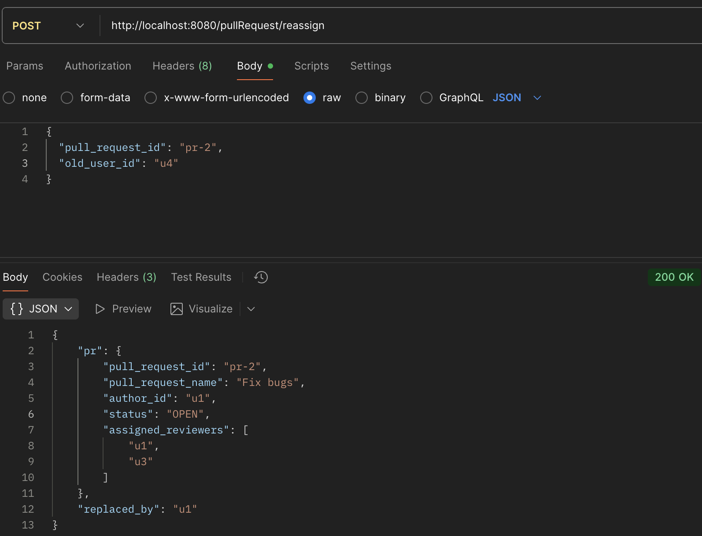

`/users/getReview`

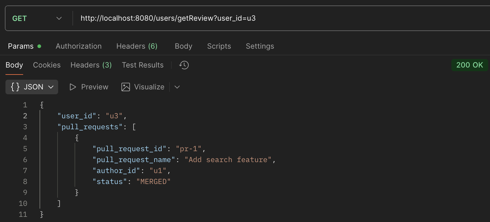


#### Дополнительные ручки

`/stats/reviewers`

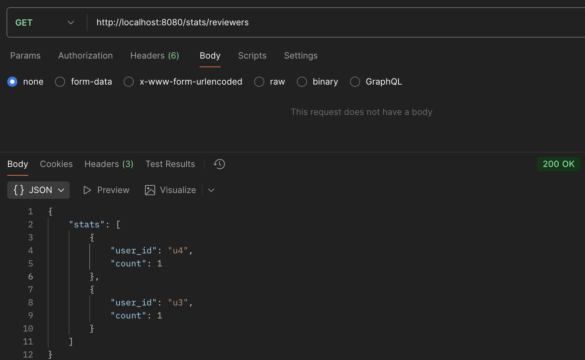

`/team/deactivateMembers`

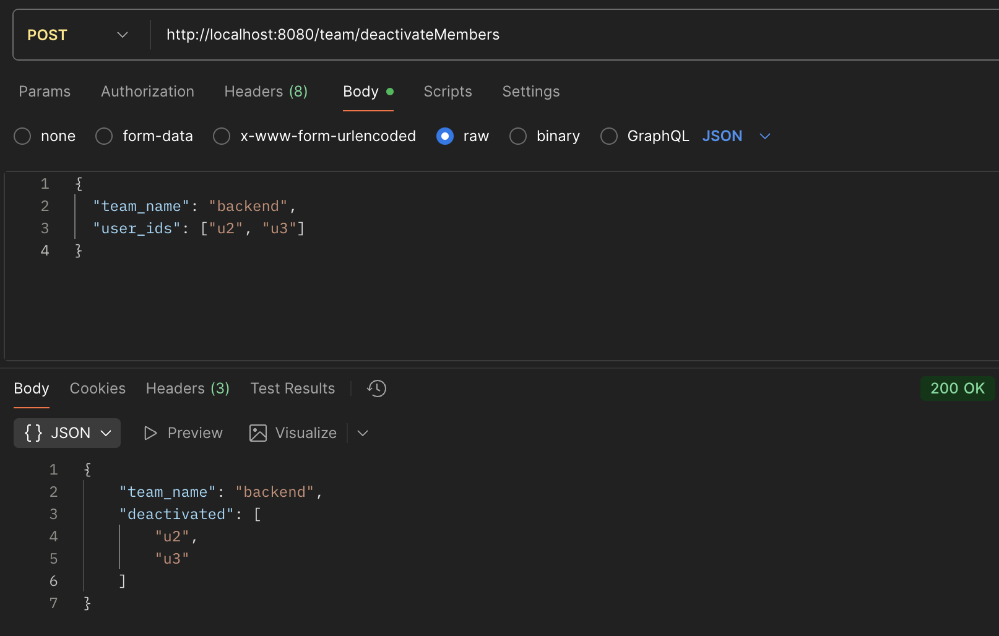